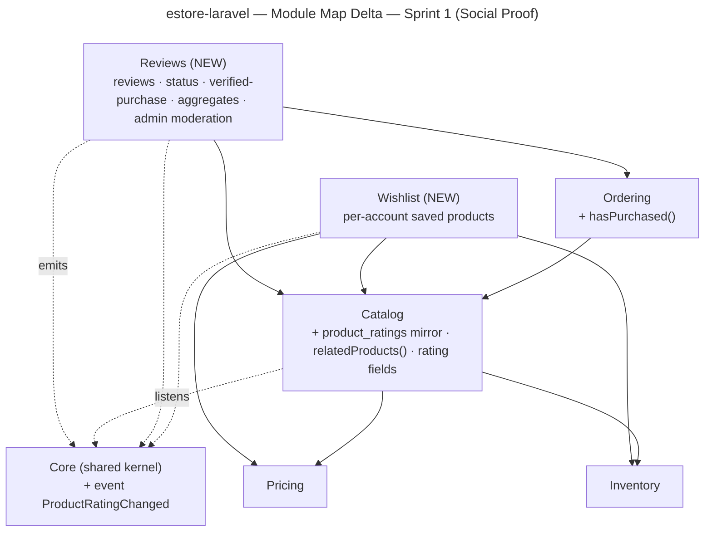
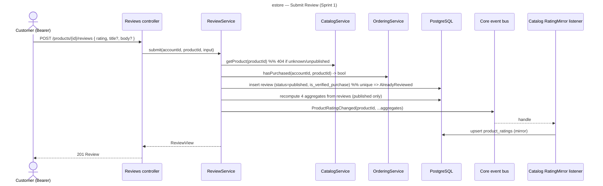

# estore — Sprint 1 (Social Proof) — System Design

**Status:** DRAFT — proposed for **Design Freeze**.
**Implements:** [`../requirements/sprint-1-social-proof.md`](../requirements/sprint-1-social-proof.md)
(Reviews FR-R1..R4, Wishlist FR-W1..W4, Related FR-X1; AC-S1..S10).
**Delta to:** v1 [`system-design.md`](./system-design.md). Reuses its style, ports, and boundary rules.

---

## 1. Architectural changes (summary)
- **Two new sealed modules:** `Reviews` (error block **1800–1899**) and `Wishlist` (reserves
  **1900–1999**, no own codes yet — reuses `catalog.ProductNotFound`).
- **One new Core event:** `Core\Events\ProductRatingChanged` — the decoupling seam that lets Catalog
  show ratings without importing Reviews (see §2 cycle analysis).
- **One new Catalog read-model (auto-mirror):** `product_ratings`, kept in sync by a Catalog listener
  on the Core event. Source of truth stays the `reviews` table; the mirror is derived (doctrine:
  "dedupe via auto-mirror, never two registries drifting").
- **Additions to existing services:** `Ordering.hasPurchased()`, `Catalog.relatedProducts()`,
  `ProductPresenter` gains the four rating fields.
- **RBAC:** new `Permission::ManageReviews = 'manage-reviews'` — auto-granted to admin by the existing
  `RoleSeeder` (pure enum insert, OCP).
- **No new dependency.**

## 2. Modules & dependency direction



**Cycle analysis (the load-bearing decision).**
- Ratings must render on the **Catalog** `Product` payload (AC-S2) — so Catalog needs the aggregate.
- A review's verified-purchase status needs **Ordering** data → `Reviews → Ordering`. And
  `Ordering → Catalog` already exists (checkout). Therefore a direct `Catalog → Reviews` read would
  close the loop `Catalog → Reviews → Ordering → Catalog` — **forbidden** (acyclic rule; same trap the
  codebase already avoided for Pricing, D22 INFO).
- **Resolution:** Catalog never imports Reviews. Reviews recomputes its aggregates (cheap SQL on its
  own table) and emits **`Core\Events\ProductRatingChanged`**; a **Catalog listener** writes the
  `product_ratings` mirror; Catalog presentation reads the mirror locally. Both sides depend only on
  **Core** — the dependency stays one-directional and acyclic.
- `Reviews → Catalog` (validate product on write) and `Reviews → Ordering` (live verified-purchase
  check) are downward edges → fine. `Wishlist → Catalog/Pricing/Inventory` are downward → fine.

**Boundary rules (unchanged + new).**
- Reviews/Wishlist reference products by **`product_public_id` (shared string)** and accounts by
  internal `account_id` — never reaching into another module's models (NFR-S3).
- **Reviews owns all its routes** (product-scoped read/write + admin moderation). Verified-purchase is a
  **live** `Ordering.hasPurchased()` query at write time — no backfill, always correct at write.
- Catalog→Reviews is **event-only** (via Core), never an import.

## 3. Ports (new + amended facades)

```
Reviews
  ReviewService:
    listForProduct(productPublicId, {verifiedOnly?, page, perPage}) -> Page<ReviewView> + summary(4 aggregates)
    submit(accountId, productPublicId, {rating, title?, body?}) -> ReviewView
        | catalog.ProductNotFound (via Catalog) | reviews.AlreadyReviewed
        # sets is_verified_purchase = Ordering.hasPurchased(accountId, productPublicId); emits ProductRatingChanged
    updateOwn(accountId, reviewPublicId, {rating?, title?, body?}) -> ReviewView | reviews.ReviewNotFound  # own-only => 404
    deleteOwn(accountId, reviewPublicId) -> void | reviews.ReviewNotFound
    aggregatesFor(productPublicIds[]) -> map<publicId, {avg, count, vAvg, vCount}>   # authoritative recompute
    # admin (manage-reviews):
    adminList({status?, productPublicId?, page}) -> Page<ReviewView>
    setStatus(reviewPublicId, published|hidden) -> ReviewView | reviews.ReviewNotFound  # emits ProductRatingChanged
    adminDelete(reviewPublicId) -> void                                                  # emits ProductRatingChanged
  (out) ReviewRepository
  (in)  CatalogService (product exists), OrderingService (hasPurchased)

Wishlist
  WishlistService:
    list(accountId) -> ProductView[]                  # presented like catalog (price/stock/rating)
    add(accountId, productPublicId) -> ProductView[]  # idempotent | catalog.ProductNotFound
    remove(accountId, productPublicId) -> ProductView[]# idempotent (absent => no-op)
  (out) WishlistRepository
  (in)  CatalogService, PricingService, InventoryService

Ordering  (amend)
  + hasPurchased(accountId, productPublicId) -> bool   # order_status in (placed, fulfilled), has matching item

Catalog  (amend)
  + relatedProducts(productPublicId, limit=4) -> ProductView[]   # published, shares >=1 category, excludes self
  ProductPresenter.present(..., ?Rating $rating)  # adds average_rating, review_count, verified_average_rating, verified_review_count
  RatingMirror (internal): readMany(productPublicIds[]) -> map ; upsert(event)   # product_ratings table

Core  (amend)
  + event ProductRatingChanged { productPublicId, reviewCount, averageRating?, verifiedReviewCount, verifiedAverageRating? }
```

## 4. Domain model (delta)

```mermaid
---
title: estore — Domain Model Delta — Sprint 1 (Social Proof)
---
erDiagram
    ACCOUNT ||--o{ REVIEW : writes
    PRODUCT ||--o{ REVIEW : "about (by product_public_id)"
    ACCOUNT ||--o{ WISHLIST_ITEM : saves
    PRODUCT ||--o{ WISHLIST_ITEM : "saved (by product_public_id)"
    PRODUCT ||--o| PRODUCT_RATING : "mirrored aggregate"

    REVIEW { bigint id PK; uuid public_id PK_opaque; fk account_id; string product_public_id; smallint rating "1..5"; string title "nullable"; text body "nullable"; string status "published|hidden"; bool is_verified_purchase; timestamptz created_at }
    WISHLIST_ITEM { bigint id PK; fk account_id; string product_public_id; timestamptz created_at }
    PRODUCT_RATING { string product_public_id PK; int review_count; numeric average_rating "nullable, 1dp"; int verified_review_count; numeric verified_average_rating "nullable, 1dp" }
```

Constraints: `REVIEW` **unique(account_id, product_public_id)** (one review per customer per product →
`reviews.AlreadyReviewed`). `WISHLIST_ITEM` **unique(account_id, product_public_id)** (idempotent add).
`PRODUCT_RATING` is a **derived read-model** owned by Catalog (not authoritative). Averages are
`null` when the relevant count is 0.

## 5. Flows

### 5.1 Submit a review (verified-purchase + aggregate mirror)


### 5.2 Product detail with dual rating
`GET /products/{id}` → Catalog `ProductController.show` builds the view from `PricingService` +
`InventoryService` + **`RatingMirror.readMany([id])`** (local read of `product_ratings`). Presenter emits
`average_rating`/`review_count` (overall) and `verified_average_rating`/`verified_review_count`. The
product list (`GET /products`) does the same in batch (one mirror read for the page). Reviews list +
per-review badges come from `GET /products/{id}/reviews`.

### 5.3 Wishlist add / list
`POST /wishlist/items {product_id}` → `WishlistService.add(accountId, id)`: `CatalogService` confirms the
product exists (else `catalog.ProductNotFound`), idempotent insert, returns the wishlist presented like
the catalog (price via Pricing, stock via Inventory, rating via the mirror). `GET /wishlist` lists; `DELETE
/wishlist/items/{productId}` removes (no-op if absent).

### 5.4 Related products
`GET /products/{id}/related` → `CatalogService.relatedProducts(id, 4)`: published products sharing ≥1
category with the target, excluding itself, newest first, capped at 4; presented with price/stock/rating.

## 6. Contract changes (amendments to `contract/openapi.yaml`)

**New paths**
| Method · Path | Auth | Body → Response |
|---|---|---|
| `GET /products/{publicId}/reviews?verified&page&per_page` | public | → `ReviewPage` (data + `summary`) |
| `POST /products/{publicId}/reviews` | customer | `ReviewInput` → `201 Review` (404 / 409 / 422) |
| `PATCH /products/{publicId}/reviews/{reviewId}` | customer (own) | `ReviewInput` → `Review` (404 / 422) |
| `DELETE /products/{publicId}/reviews/{reviewId}` | customer (own) | → `204` (404) |
| `GET /products/{publicId}/related` | public | → `Product[]` (≤ 4) |
| `GET /wishlist` | customer | → `Wishlist` |
| `POST /wishlist/items` | customer | `WishlistItemInput` → `Wishlist` (404) |
| `DELETE /wishlist/items/{productId}` | customer | → `Wishlist` |
| `GET /admin/reviews?status&product_id&page` | admin `manage-reviews` | → `ReviewPage` (403) |
| `PATCH /admin/reviews/{reviewId}` | admin | `ReviewModerationInput {status}` → `Review` (403 / 404) |
| `DELETE /admin/reviews/{reviewId}` | admin | → `204` (403 / 404) |

**New/changed schemas**
- `Product` (amend): add `average_rating` (number, 1dp, nullable), `review_count` (int),
  `verified_average_rating` (number, nullable), `verified_review_count` (int) — all four **present on
  every product view** (counts default 0, averages null).
- `Review`: `{ id(uuid), product_id(uuid), rating(int 1..5), title?(string), body?(string),
  author_name(string), is_verified_purchase(bool), status(enum published|hidden), created_at }`.
- `ReviewInput`: `{ rating(int 1..5, required), title?(≤120), body?(≤2000) }`.
- `ReviewModerationInput`: `{ status: enum [published, hidden] }`.
- `RatingSummary`: the four aggregate fields; `ReviewPage = allOf(Page, { data: Review[], summary: RatingSummary })`.
- `Wishlist`: `{ items: Product[] }`. `WishlistItemInput`: `{ product_id(uuid) }`.

A new decision (D-series) records each amendment, per the post-freeze contract rule.

## 7. Cross-cutting
- **Error codes (catalog → 1800s):** `1800 reviews.ReviewNotFound (404)` (unknown or not-owned —
  scope-before-authorize), `1801 reviews.AlreadyReviewed (409)`. Rating-range / length violations →
  `common.ValidationFailed (1000)` via FormRequest. Wishlist reuses `catalog.ProductNotFound (1300)`;
  remove-absent is idempotent (no error). Block 1900 reserved.
- **Security:** review `title`/`body` stored raw, rendered as **text (never `v-html`)** on the
  frontend (NFR-S1); lengths capped at the boundary; review POST under the existing per-identity+per-IP
  throttle (NFR-S2). `author_name` = `User.name` (fallback `"Customer"` if blank); **email never
  exposed**. Own-review edit/delete: not-owned is indistinguishable from unknown → **404**.
- **Privacy:** hidden reviews are excluded from all public lists, the `summary`, and the mirror
  aggregates; visible only via `GET /admin/reviews`.

## 8. Decisions proposed (to log on Design Freeze)
- **D27 — Reviews module + event-driven rating mirror.** Catalog shows ratings via a derived
  `product_ratings` read-model updated by a `Core\Events\ProductRatingChanged` listener; Catalog never
  imports Reviews. Breaks the `Catalog→Reviews→Ordering→Catalog` cycle; keeps deps acyclic. Verified
  purchase = live `Ordering.hasPurchased()` at write.
- **D28 — Dual rating on the product payload.** `Product` carries overall + verified-buyers averages and
  counts (resolves spec OQ-1). Reviews open to all logged-in customers; per-review verified badge.
- **D29 — Wishlist as a sealed module, customers-only.** Reuses Catalog/Pricing/Inventory for
  presentation; idempotent add/remove; `catalog.ProductNotFound` reused. Guest wishlist → backlog.

## 9. How the design meets the spec
| AC | Met by |
|---|---|
| AC-S1 | §5.2 dual rating + `GET .../reviews` (badge, `?verified`) |
| AC-S2 | §3 ProductPresenter four fields + `product_ratings` mirror |
| AC-S3 / AC-S4 | §5.1 submit (auth-guarded; unique → AlreadyReviewed) |
| AC-S5 | `updateOwn`/`deleteOwn` (own-only 404) + aggregate recompute |
| AC-S6 | `setStatus`/`adminDelete` (manage-reviews); hidden excluded from mirror + summary |
| AC-S7 | §5.3 Wishlist add/list/remove, idempotent, customers-only |
| AC-S8 | §5.4 `relatedProducts` |
| AC-S9 | §7 text-not-HTML render + boundary length caps |
| AC-S10 | §6 contract amendments (Spectator) + §7 error catalog (1800s) |
```

