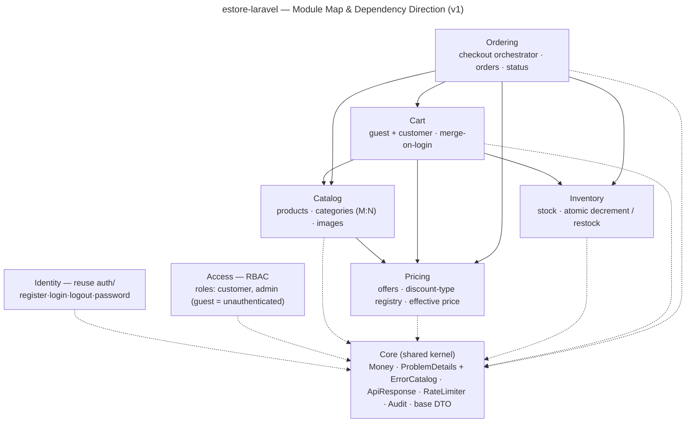
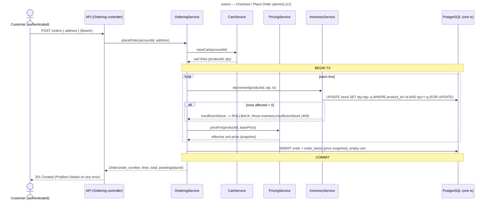
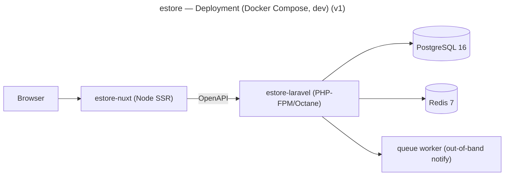

# estore-laravel — System Design (v1)

**Status:** DRAFT — proposed for **Design Freeze**. Satisfies the frozen `spec.md`. Architecture style,
module boundaries, ports, domain model, the primary flow, cross-cutting mechanisms, and the locked
stack. Auth + rate-limiting **reuse** the `system-design-components` designs (D12) — referenced, not
duplicated. The **root OpenAPI contract + error catalog** are the next Stage 2 sub-step.

---

## 1. Architecture style
**Modular monolith** (one deployable app, one PostgreSQL DB, in-process calls) — i.e. **Level 1** of
your `system-design-components` ladder. Each module is a sealed slice with a small public **service
facade**; other modules call that facade **in-process** and **never touch another module's tables**.
Transactions live in services; repositories are pure CRUD. This is the baseline a future Spring Boot /
.NET re-implementation is measured against, all conforming to the same OpenAPI contract.

## 2. Modules & dependency direction



**Boundary rules**
- `Pricing.priceFor(productId, basePrice)` takes the base price **as an argument** → Catalog→Pricing
  only, **no cycle**.
- **Ordering is the only checkout orchestrator**; it owns the single atomic transaction (validate +
  decrement + create order + snapshot + empty cart).
- **Admin operations live inside the owning module** (Catalog/Pricing/Inventory/Ordering), gated by
  **Access** policies — no god "Admin" module (OCP: a new admin capability is added in its module).
- Deps are **one-directional**, acyclic; everything depends on **Core**; nothing depends on Identity/
  Access except via the HTTP layer (middleware/policies).

## 3. Ports (public service facades + outbound repository ports)
Language-agnostic; each module's facade is its only entry point.

```
Catalog
  CatalogService:
    listProducts(filter, sort, page) -> Page<ProductView>     # effective price via Pricing
    getProduct(publicId) -> ProductView | NotFound
    listCategories() -> Category[]
    productsInCategory(categorySlug, page) -> Page<ProductView>
  (out) ProductRepository, CategoryRepository

Pricing
  PricingService:
    priceFor(productId, basePrice: Money) -> EffectivePrice{ base, effective, offer? }
    activeOfferFor(productId, at) -> Offer | null
  DiscountStrategy (registry, keyed by DiscountType): PercentageDiscount, FixedDiscount  # OCP
  (out) OfferRepository

Inventory
  InventoryService:
    availabilityFor(productId) -> int
    decrement(productId, qty, tx)  -> void | InsufficientStock   # guarded, tx-bound
    restock(productId, qty, tx)    -> void
  (out) StockRepository

Cart
  CartService:
    addItem(cartRef, productId, qty) -> Cart | InsufficientStock | ProductNotFound
    viewCart(cartRef) -> CartView
    updateItem(cartRef, productId, qty) -> Cart
    removeItem(cartRef, productId) -> Cart
    merge(guestToken, accountId) -> Cart        # on login
  (out) CartRepository    # cartRef = accountId (customer) | guest cart_token

Ordering
  OrderingService:
    placeOrder(accountId, address) -> Order      # one atomic tx; reads Cart, calls Pricing+Inventory
    listOrders(accountId, page) -> Page<OrderSummary>
    getOrder(accountId, orderNumber) -> Order | NotFound   # own only (404 otherwise)
    transition(orderNumber, target) -> Order     # admin: placed->fulfilled|cancelled (cancel restocks)
  (out) OrderRepository

Identity / Access  -> per system-design-components/auth (facade: register/login/logout/identify/
                      forgot/reset/change) + spatie/laravel-permission policies.
```

## 4. Domain model

```mermaid
---
title: estore — Domain Model / ER (v1)
---
erDiagram
    ACCOUNT ||--o{ ORDER : places
    ACCOUNT ||--o| CART : owns
    PRODUCT ||--o{ CATEGORY_PRODUCT : in
    CATEGORY ||--o{ CATEGORY_PRODUCT : groups
    PRODUCT ||--o| STOCK_ITEM : has
    PRODUCT ||--o{ OFFER_PRODUCT : targeted_by
    OFFER ||--o{ OFFER_PRODUCT : targets
    CART ||--o{ CART_ITEM : contains
    PRODUCT ||--o{ CART_ITEM : referenced
    ORDER ||--o{ ORDER_ITEM : contains
    PRODUCT ||--o{ ORDER_ITEM : referenced

    ACCOUNT { uuid public_id PK_opaque; string identifier; string password_hash }
    PRODUCT { uuid public_id PK_opaque; string slug; string name; text description; numeric base_price; string currency; bool published }
    CATEGORY { uuid public_id; string slug; string name }
    OFFER { uuid public_id; string name; enum discount_type; numeric value; timestamptz starts_at; timestamptz ends_at; bool active }
    STOCK_ITEM { fk product_id; int quantity }
    CART { id; fk account_id "nullable"; string cart_token "nullable, guest" }
    CART_ITEM { fk cart_id; fk product_id; int quantity }
    ORDER { string order_number PK_opaque; fk account_id; enum order_status; enum payment_status; jsonb address; numeric total; string currency; timestamptz placed_at }
    ORDER_ITEM { fk order_id; fk product_id; string name_snapshot; numeric unit_price_snapshot; int quantity; numeric line_total }
```

Notes: **Identity tables** (`IDENTIFIER`, `SESSION`, `API_TOKEN`, `PASSWORD_RESET`, `AUTH_EVENT`) and
**RBAC tables** come from the reused `auth` design + spatie. A `CART` is owned by **exactly one of**
`account_id` (customer) or `cart_token` (guest) — enforced by a check constraint.

## 5. Primary flow — checkout (place order)



This single flow exercises Ordering→Cart/Inventory/Pricing, the atomic-decrement guard (AC-7), the
price snapshot (judgment call #2), and the RFC 9457 error path.

## 6. Cross-cutting mechanisms
- **Error handling** — `Core` base `DomainException{ status, code, codeName, safeMessage }` → subclasses
  per module; the **framework-native central handler** renders **RFC 9457 Problem Details** (+ `code`,
  `code_name`). Framework exceptions mapped centrally. All codes in `contract/error-catalog.md` (next
  sub-step). Per D17/D18, NFR-11/14.
- **Auth** — reuse `auth/modular-monolith`: one verify path, per-channel credential-issuer **registry**
  (SessionIssuer/TokenIssuer via Sanctum), generic + timing-safe, opaque ids, audit log.
- **Authorization** — `spatie/laravel-permission`; roles **customer** / **admin** (guest = unauthenticated).
  Scope-before-authorize: ownership → 404, capability → 403 (NFR-8).
- **Rate limiting** — reuse `rate-limiting` design: **per-identity + per-IP** buckets on Redis, on auth +
  public endpoints (NFR-6).
- **Money** — exact decimal: Postgres `NUMERIC(12,2)` + currency code ↔ `brick/Money`; never float (NFR-3).
- **Public ids** — `UUIDv4` public id for products/accounts; **random opaque `order_number`**; internal
  bigint PK never exposed (NFR-2).
- **Validation** — `spatie/laravel-data` typed DTOs + FormRequests at the boundary (NFR-7).

## 7. Stack (locked) & deployment
| Concern | Choice |
|---|---|
| Runtime | Laravel 13, PHP 8.3; `nwidart/laravel-modules` |
| DB | PostgreSQL 16 |
| Cache / queue / rate-limit | Redis 7 |
| Auth | Sanctum (cookie SPA + bearer) |
| Frontend | Nuxt 3 SSR + Pinia; API client generated from the OpenAPI |
| Contract validation | `hotmeteor/spectator` (impl validated against the hand-authored OpenAPI) |
| Tests | Pest (unit + feature/integration), ≥80% logic (NFR-13) |



## 8. How the design meets the spec
- Every **FR** maps to a module facade method (§3). Every **NFR** has a mechanism (§6). The **contract**
  (NFR-1) is authored next and enforced by Spectator. **Atomicity** (NFR-4/AC-7) is the guarded
  conditional UPDATE under `FOR UPDATE` in one tx (§5).

## 9. Next Stage-2 sub-step (before Design Freeze)
1. **Root OpenAPI 3.1 contract** (`contract/openapi.yaml`) — all v1 endpoints, schemas, the Problem
   Details error schema.
2. **Error catalog** (`contract/error-catalog.md`) — every `code` / `code_name` per module block (D18).
3. Optionally: per-module `base/` design docs in your template, authored just-in-time per module in Stage 4.
